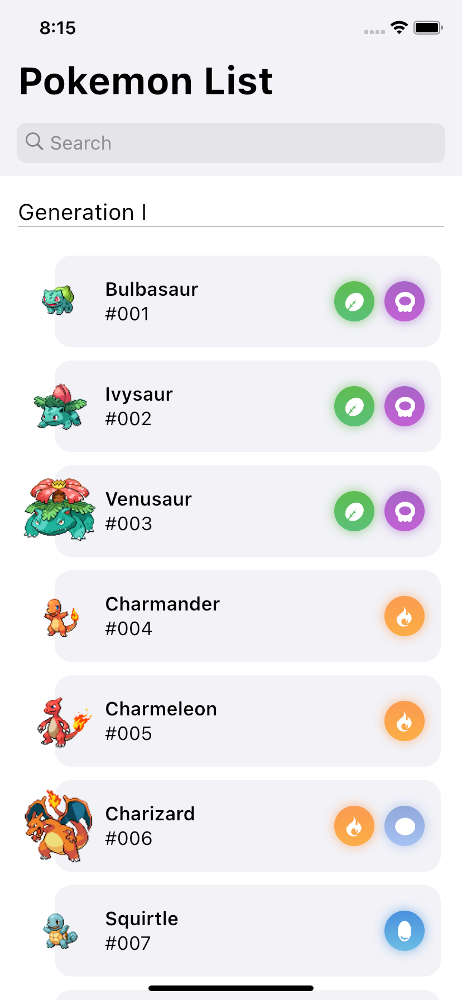
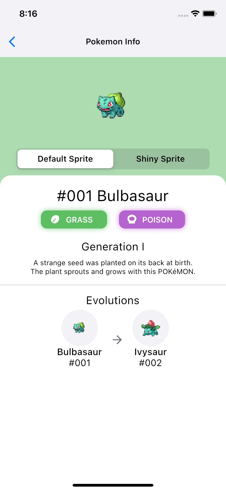
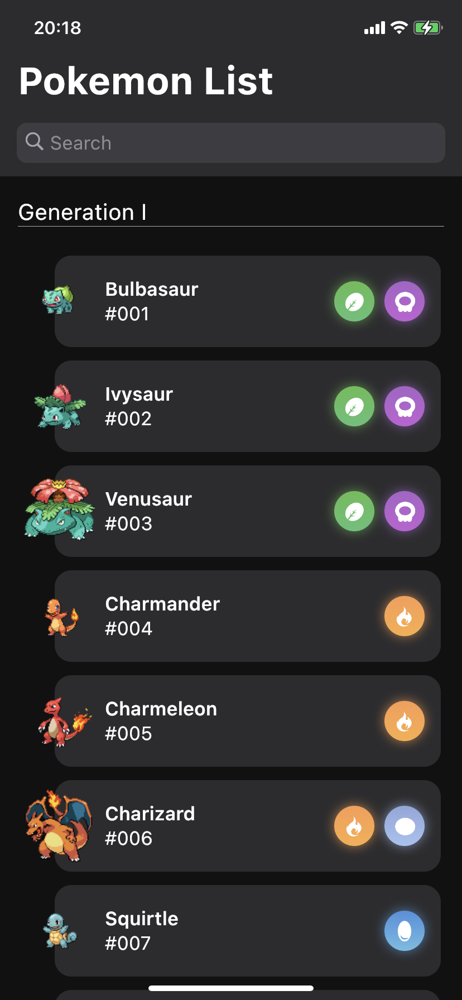
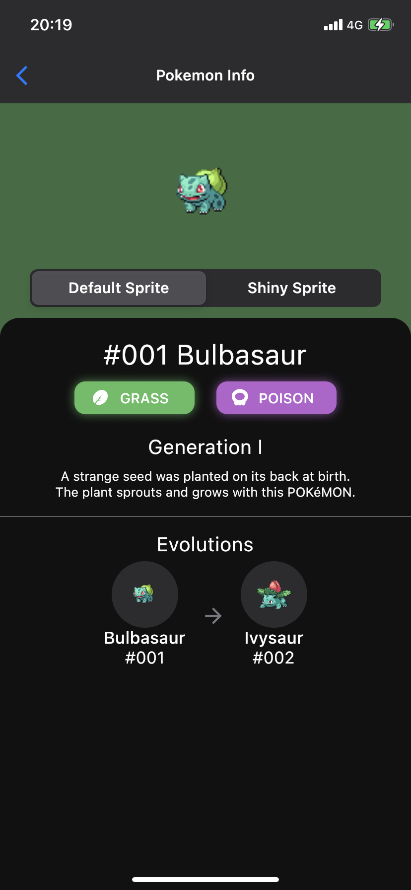
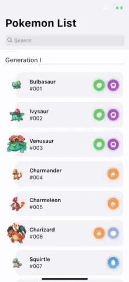
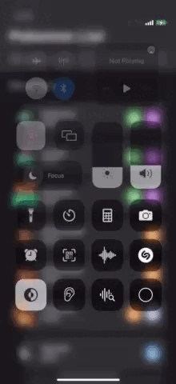

# Ravn-Challenge-V3-Gerardo-Villegas

## Description

This is a mobile application that lists pokemon and separates them by generations, it includes a search engine by pokemon name and when one is pressed it shows the details of the pokemon such as images, types, generation, description and evolutions

## Architecture

The app use Clean Architecture and Patron Bloc

- Data layer: The data layer is located at the outermost layer. This layer consists of data source code such as consume Rest API y access to the local database.

- Presentation Layer: The presentation layer consists of the code to access the data of the app from a repository. Also, there is the code for state management such as providers, BLoC, and so on.

- Domain Layer: The domain layer is the deepest in the clean architecture. This layer contains the code for business logic applications such as entities and use cases.

## Setup and Running

### Pre-requisites

For run this application you must install [Flutter](https://flutter.dev/) 2.0 or higher.

You can know how to install flutter [here](https://flutter.dev/docs/get-started/install)

### Installation

After to clone the repository from `master` branch next open a console on the folder and move to the `Ravn-Challenge-V3-Gerardo-Villegas` folder

```bash
# move to the app project
cd Ravn-Challenge-V3-Gerardo-Villegas
```
Next download the `flutter` dependencies with:
```bash
# get dependencies
flutter pub get
```

### Usage

Next to download dependencies you have to have an android emulator or ios emulator switched on and execute the following command.

The mobile app has three environments development, staging and production

```bash
# run in development environment
flutter run --target lib/main_development.dart --flavor development
```
```bash
# run in staging environment
flutter run --target lib/main_staging.dart --flavor staging
```
```bash
# run in production environment
flutter run --target lib/main_production.dart --flavor production
```

### Run unit test

For run the unit tests you must run the following command remember that to run the tests is necessary to install the dependencies

```bash
flutter test
```

## App images
<table>
    <tr>
        <th>Pokemon List</th>
        <th>Pokemon Info</th>
    </tr>
	<tr>
        <td></td>
        <td></td>        
	</tr>
</table>

<table>
    <tr>
        <th>Pokemon List Dark</th>
        <th>Pokemon Info Dark</th>
    </tr>
	<tr>
        <td></td>
        <td></td>
	</tr>
</table>

<table>
    <tr>
        <th>App change theme</th>
        <th>App disconnected</th>
    </tr>
	<tr>
        <td></td>
        <td></td>
	</tr>
</table>


## Additional information

- For access the dark mode the device has to change to dark mode and the app will change colors automacly.

- For change the language the device has change the system language between English and Spanish.

## Builded with

- [Flutter](https://flutter.dev/) - SDK for develop.
- [REST](https://www.redhat.com/es/topics/api/what-is-a-rest-api) - Request web service.
- [GraphQL](https://graphql.org/) - Request web service.
- [Sembast](https://pub.dev/packages/sembast) - Local database.
